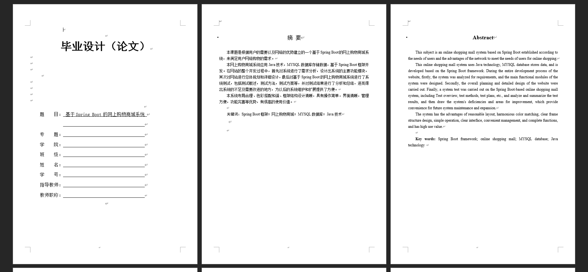
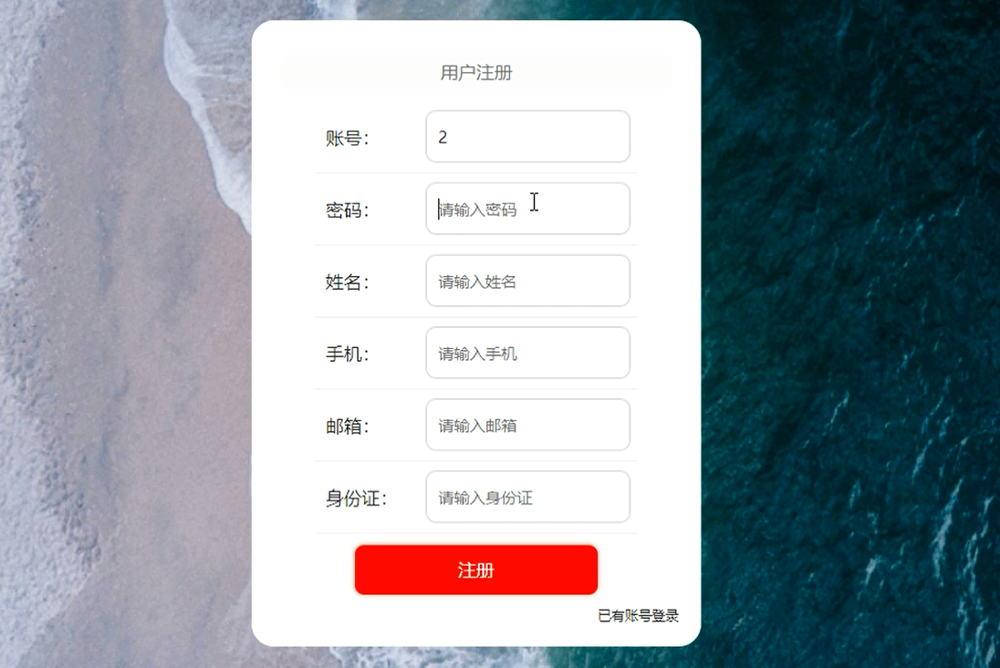
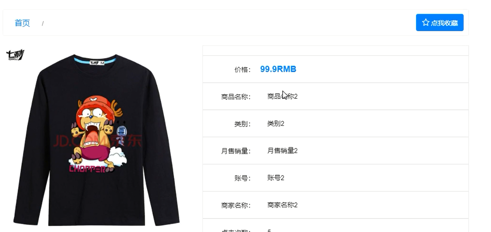
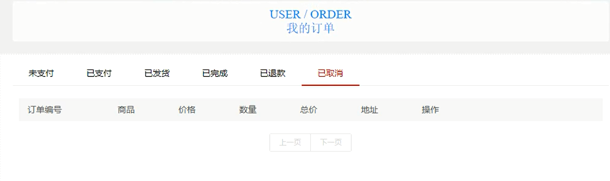
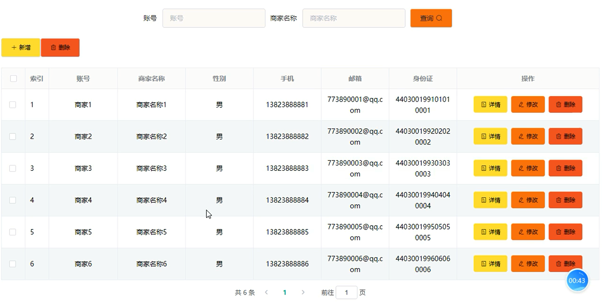
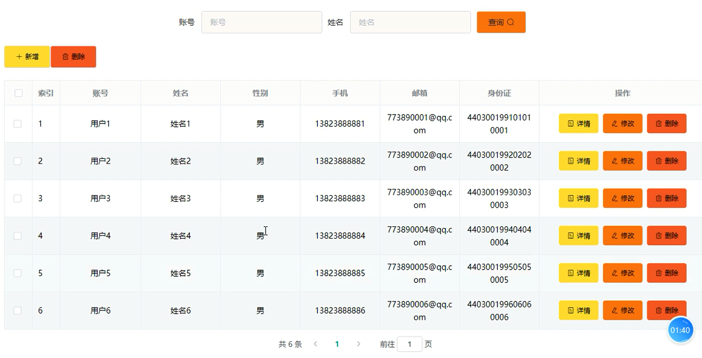
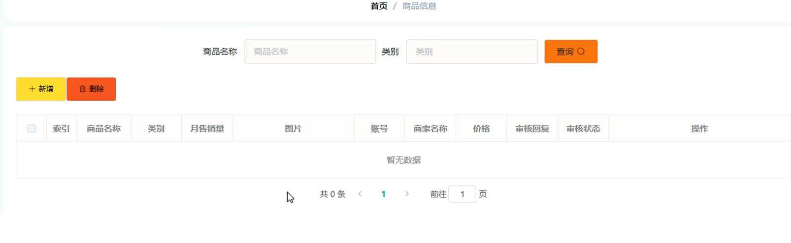

基于Springboot的网上购物商城系统（程序+论文）
=
### 完整代码获取地址：从戎源码网 ([https://armycodes.com/](https://armycodes.com/))
### 作者微信：19941326836  QQ：952045282 
### 承接计算机毕业设计、Java毕业设计、Python毕业设计、深度学习、机器学习
### 选题+开题报告+任务书+程序定制+安装调试+论文+答辩ppt 一条龙服务
### 所有选题地址https://github.com/nature924/allProject

一、项目介绍
---
系统包含两种角色：用户、管理员，系统分为前台和后台两大模块，主要功能如下：

### 1.用户功能模块的实现

- 用户注册界面  
  用户可以在注册界面进行账号注册，输入必要的信息完成注册。

- 用户登录界面  
  用户在登录界面输入用户名和密码，选择登录类型后点击登录按钮以进行系统操作。

- 个人中心界面  
  登录后的用户可以在个人中心查看和修改个人信息，包括联系方式和地址。

- 商品详情界面  
  用户可以查看商品的详细信息，如价格、描述和图片，并可以将商品添加到购物车或直接购买。

- 购物车界面  
  用户在购物车界面查看已添加的商品信息，进行数量修改、删除商品或结算操作。

- 我的订单界面  
  用户可以查看自己所有的订单信息，包括订单状态和详细内容。

- 我的地址界面  
  用户可以增、删、改查个人地址信息，以管理配送服务。

### 2.管理员功能模块的实现

- 管理员登录界面  
  管理员需在登录界面输入账号和密码以进入系统后台进行管理操作。

- 商家管理界面  
  管理员可以对商家信息进行增、删、改查操作，以管理商家的数据。

- 用户管理界面  
  管理员可以查看、修改和删除用户信息，并可新增用户，进行用户数据管理。

- 商品分类管理界面  
  管理员可以对商品分类信息进行增、删、改查操作，管理商品分类。

3.商家功能模块的实现

- 商品信息管理界面  
  商家可以在此界面进行商品信息的添加、修改和删除操作，以管理店铺中的商品。

- 添加商品信息界面  
  商家可以在此界面输入新商品的信息并进行添加，包括基本信息、价格和库存。

二、项目技术
---
- 编程语言：Java
- 数据库：MySQL
- 项目管理工具：Maven
- 前端技术：VUE、HTML、Jquery、Bootstrap
- 后端技术：Spring、SpringMVC、MyBatis

三、运行环境
---
- 操作系统：Windows、macOS都可以
- JDK版本：JDK1.8以上都可以
- 开发工具：IDEA、Ecplise、Myecplise都可以
- 数据库: MySQL5.7以上都可以
- Tomcat：任意版本都可以
- Maven：任意版本都可以

四、运行截图
---
### 论文截图：

### 程序截图：

